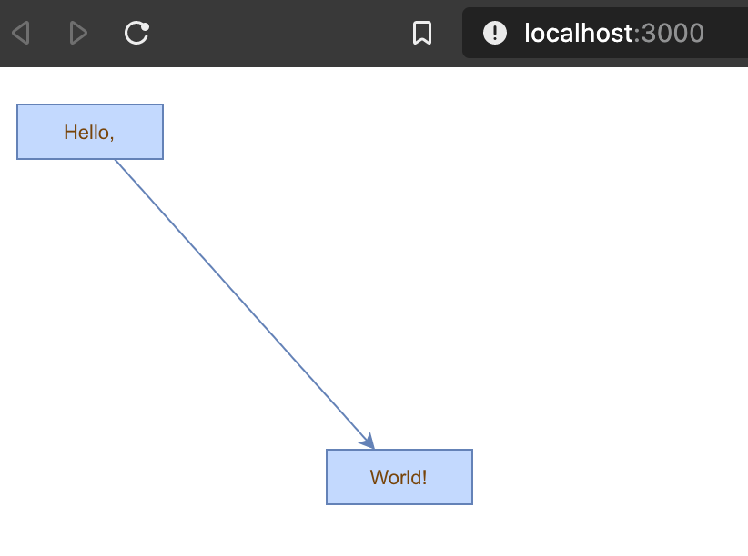

# React mxgraph and TypeScript starter app

This project was bootstrapped with [Create React App](https://github.com/facebook/create-react-app).

- React 16.13+
- mxgraph 4.1+
- TypeScript 3.7+ starter app

Uses:

- [ts-mxgraph](https://www.npmjs.com/package/ts-mxgraph)
- [mxgraph](https://www.npmjs.com/package/mxgraph)

## Demo

Install dependencies `yarn install`

Run `yarn start`



## Using mxgraph

- [mxgraph Tutorial](https://jgraph.github.io/mxgraph/docs/tutorial.html)
- [mxgraph manual](https://jgraph.github.io/mxgraph/docs/manual.html#1.6.1)
- [maxgraph API specification](https://jgraph.github.io/mxgraph/docs/js-api/files/index-txt.html)

### The mxGraph Model and archictecture

Although the transactions to the model are stored on the model, mxGraph is designed in such a way that the main public API is through the mxGraph class.

Though many of the main API calls are through the `mxGraph` class, keep in mind that `mxGraphModel` is the underlying object that stores the data structure of your graph.

`mxGraph` uses a transactional system for making changes to the model.

For each change to the model you make a call to `beginUpdate()`, make the appropriate calls to change the model, then call `endUpdate()` to finalize the changes and have the change event notifications sent out.

Key API Methods:

```js
mxGraphModel.beginUpdate() - starts a new transaction or a sub-transaction.
mxGraphModel.endUpdate() - completes a transaction or a sub-transaction.
mxGraph.addVertex() - Adds a new vertex to the specified parent cell.
mxGraph.addEdge() - Adds a new edge to the specified parent cell.
```  

### Model change methods

list of the methods that alter the graph model and should be placed, directly or indirectly, with the scope of an update:

```js
add(parent, child, index)
remove(cell)
setCollapsed(cell, collapsed)
setGeometry(cell, geometry)
setRoot(root)
setStyle(cell, style)
setTerminal(cell, terminal, isSource)
setTerminals(edge,source,target)
setValue(cell, value)
setVisible(cell, visible)
```

Core API functions:

`mxGraph.insertVertex(parent, id, value, x, y, width, height, style)` – creates and inserts a new vertex into the model, within a begin/end update call.
`mxGraph.insertEdge(parent, id, value, source, target, style)` – creates and inserts a new edge into the model, within a begin/end update call.

The parameters of the function:

`parent` – the cell which is the immediate parent of the new cell in the group structure. We will address the group structure shortly, but for now use `graph.getDefaultParent();` as your default parent, as used in the HelloWorld example.

`id` – this is a global unique identifier that describes the cell, it is always a string. This is primarily for referencing the cells in the persistent output externally. If you do not wish to maintain ids yourself, pass null into this parameter and ensure that `mxGraphModel.isCreateIds()` returns `true`. This way the model will manage the ids and ensure they are unique.

`value` – this is the user object of the cell. User object are simply that, just objects, but form the objects that allow you to associate the business logic of an application with the visual representation of `mxGraph`. They will be described in more detail later in this manual, however, to start with if you use a string as the user object, this will be displayed as the label on the vertex or edge.

`x, y, width, height` – as the names suggest, these are the x and y position of the top left corner of the vertex and its width and height.

`style` – the style description to be applied to this vertex. Styles will be described in more detail shortly, but at a simple level this parameter is a string that follows a particular format. In the string appears zero or more style names and some number of key/value pairs that override the global style or set a new style. Until we create custom styles, we will just use those currently available.

### mxCell

`mxCell` is the cell object for both vertices and edges. `mxCell` duplicates many of the functions available in the model. When creating a new cell, three things are required in the constructor, a `value` (user object), a `geometry` and a `style`.

### Style

The concept of styles and stylesheets in conceptually similar to CSS stylesheets.
Open up the `util.mxConstants.js` file (from `mxgraph` or `mxgraph-js` repos) in your editor and search for the first match on “STYLE_”. If you scroll down you will see a large number of strings defined for all the various styles available with this prefix. Some of styles apply to vertices, some to edges and some to both.

```js
var v1 = graph.insertVertex(parent, null, 'Hello', 20, 20, 80, 30, 'ROUNDED');

// To create a new vertex with the ROUNDED style, overriding the stroke and fill colors:

var v1 = graph.insertVertex(parent, null, 'Hello',  20, 20, 80, 30, 'ROUNDED;strokeColor=red;fillColor=green');
```

Core API functions:

`mxGraph.setCellStyle(style, cells)` – Sets the style for the array of cells, encapsulated in a begin/end update.

`mxGraph.getCellStyle(cell)` – Returns the style for the specified cell, merging the styles from any local style and the default style for that cell type.

To create the `ROUNDED` global style described above, you can follow this template to create a style and register it with `mxStyleSheet`:

```js
var style = new Object();
style[mxConstants.STYLE_SHAPE] = mxConstants.SHAPE_RECTANGLE;
style[mxConstants.STYLE_OPACITY] = 50;
style[mxConstants.STYLE_FONTCOLOR]= '#774400';
graph.getStylesheet().putCellStyle('ROUNDED',style);
```

### Geometry

The reason for a separate `mxGeometry` class, as opposed to simply having the mxRectangle class store this information, is that the edges also have geometry information.

The `width` and `height` values are ignored for edges and the x and y values relate to the positioning of the edge label. In addition, edges have the concept of control points. These are intermediate points along the edge that the edge is drawn as passing through. The use of control points is sometimes referred to as edge routing.

Core API functions:

`mxGraph.resizeCell(cell, bounds)` – Resizes the specified cell to the specified bounds, within a begin/end update call.
`mxGraph.resizeCells(cells, bounds)` – Resizes each of the cells in the cells array to the corresponding entry in the bounds array, within a begin/end update call.

### User objects

The User object is what gives mxGraph diagrams a context, it stores the business logic associated with a visual cell.

In the simple case, it simply represents the label that will be displayed for that cell. In more complex applications, these user objects will be objects instead. Some attribute of that object will generally be the label that the visual cell will display, the rest of the object describes logic relating to the application domain.

Typically, this workflow will exist on some application server and/or database. The browser user connects to that server, or some front-end server linked to the application server and the user's web application requests the “order” workflow. The server obtains the data of that workflow and transmits it to the client.

mxGraph supports the process of populating the model on the server-side and transmitting to the client, and back again. See the later chapter on “I/O and Server Communication”.

### Grouping

Grouping, within mxGraph, is the concept of logically associating cells with one another. This is commonly referred to as the concept of sub-graphs in many graph toolkits. Grouping involves one or more vertices or edges becoming children of a parent vertex or edge (usually a vertex) in the graph model data structure. 

- Sub-graphs
- Expanding and collapsing
- Layering
- Drill down, step up

Core API functions:

`mxGraph.groupCells(group, border, cells)` – Adds the specified cells to the specified group, within a begin/end update

`mxGraph.ungroupCells(cells)` – Removes the specified cells from their parent and adds them to their parent's parent. Any group empty after the operation are deleted. The operation occurs within a begin/end update.

#### Folding

Folding is the collective term we use for expanding and collapsing groups. We say a cell is folded by making it's child vertices invisible.

Core API function:

`mxGraph.foldCells(collapse, recurse, cells)` – States the collapsed state of the specificed cells, within a begin/end update.

`mxGraph.isCellFoldable(cell, collapse)` – By default true for cells with children.
`mxGraph.isCellCollapsed(cell)` – Returns the folded state of the cell

Core API functions:

`mxGraph.enterGroup(cell)` – Makes the specified cell the new root of the display area.
`mxGraph.exitGroup()` - Makes the parent of the current root cell, if any, the new root cell.
`mxGraph.home()` - Exits all groups, making the default parent the root cell.

### Layering and Filtering

In mxGraph, like many graphical applications, there is the concept of z-order. That is, the order of objects as you look into the screen direction. Objects can be behind or in front of other objects and if they overlap and are opaque then the back-most object will be partially or complete obscured.

Core API function:

`mxGraph.orderCells(back, cells)` – Moves the array of cells to the front or back of their siblings, depending on the flag, within a begin/end update.

## Layouts

### Hierarchical

[mxHierarchicalLayout](https://jgraph.github.io/mxgraph/docs/js-api/files/layout/hierarchical/mxHierarchicalLayout-js.html)

Use to create pyramid-like relationships, such as an organisational diagram

```ts
const layout = new mxHierarchicalLayout(graph);
layout.execute(graph.getDefaultParent());
```

### Swimlane

[mxSwimlaneLayout](https://jgraph.github.io/mxgraph/docs/js-api/files/layout/hierarchical/mxSwimlaneLayout-js.html)

```ts
const layout = new mxSwimlaneLayout(graph);
layout.execute(graph.getDefaultParent());
```

### Circular

[mxCircleLayout](https://jgraph.github.io/mxgraph/docs/js-api/files/layout/mxCircleLayout-js.html)

Layout nodes in a circle

```ts
const layout = new mxCircleLayout(graph);
layout.execute(graph.getDefaultParent());
```

### Organic

```ts
var layout = new mxFastOrganicLayout(graph);
layout.execute(graph.getDefaultParent());
```

### Tree layout

Suitable for graphs that have no cycles (trees)

Compact:

```ts
const layout = new mxCompactTreeLayout(graph);
layout.execute(graph.getDefaultParent());
```

Radial:

```ts
var layout = new mxRadialTreeLayout(graph);
layout.execute(graph.getDefaultParent());
```

## Cell images

To use images in cells, a shape must be specified in the default vertex style (or any named style).  Possible shapes are `mxConstants.SHAPE_IMAGE` and `mxConstants.SHAPE_LABEL`.  The code to change the shape used in the default vertex style, the following code is used:

```ts
var style = graph.getStylesheet().getDefaultVertexStyle();
style[mxConstants.STYLE_SHAPE] = mxConstants.SHAPE_IMAGE;
```

For the default vertex style, the image to be displayed can be specified in a cell’s style using the `mxConstants.STYLE_IMAGE` key and the image `URL` as a value, for example:

`image=http://www.example.com/image.gif`

For a named style, the the stylename must be the first element of the cell style:

`stylename;image=http://www.example.com/image.gif`

A cell style can have any number of key=value pairs added, divided by a semicolon as follows:

`[stylename;|key=value;]`

## Labels

The cell labels are defined by `getLabel` which uses `convertValueToString` if `labelsVisible` is `true`.

## In-place editing

In-place editing is started with a double-click or by typing `F2`.  Programmatically, edit is used to check if the cell is editable (`isCellEditable`) and call `startEditingAtCell`, which invokes `mxCellEditor.startEditing`.  The editor uses the value returned by `getEditingValue` as the editing value. 

After in-place editing, `labelChanged` is called, which invokes `mxGraphModel.setValue`, which in turn calls `mxGraphModel.valueForCellChanged`

## Tooltips

Tooltips are implemented by `getTooltip`, which calls `getTooltipForCell` if a cell is under the mousepointer.

```ts
graph.getTooltipForCell = function(cell)
{
  var label = this.convertValueToString(cell);
  return 'Tooltip for '+label;
}
```

When using a config file, the function is overridden in the mxGraph section using the following entry:

```xml
<add as="getTooltipForCell"><![CDATA[
  function(cell)
  {
    var label = this.convertValueToString(cell);
    return 'Tooltip for '+label;
  }
]]></add>
```

For replacing the default implementation of `getTooltipForCell` (rather than replacing the function on a specific instance), the following code should be used after loading the JavaScript files, but before creating a new `mxGraph` instance using `mxGraph`:

```ts
mxGraph.prototype.getTooltipForCell = function(cell)
{
  var label = this.convertValueToString(cell);
  return 'Tooltip for '+label;
}
```

## Shapes & Styles

The implementation of new shapes is demonstrated in the examples.  We’ll assume that we have implemented a custom shape with the name `BoxShape` which we want to use for drawing vertices.  To use this shape, it must first be registered in the cell renderer as follows:

`mxCellRenderer.registerShape('box', BoxShape);`

The code registers the `BoxShape` constructor under the name box in the cell renderer of the graph. The shape can now be referenced using the shape-key in a style definition.

The cell renderer contains a set of additional shapes, namely one for each constant with a `SHAPE-` prefix in `mxConstants`.

Styles are a collection of key, value pairs and a stylesheet is a collection of named styles.  The names are referenced by the cellstyle, which is stored in mxCell.style with the following format: `[stylename;|key=value;]`.

When introducing a new shape, the name under which the shape is registered must be used in the stylesheet.  There are three ways of doing this:

- By changing the default style, so that all vertices will use the new shape
- By defining a new style, so that only vertices with the respective cellstyle will use the new shape
- By using shape=box in the cellstyle’s optional list of key, value pairs to be overridden

In the first case, the code to fetch and modify the default style for vertices is as follows:

```ts
var style = graph.getStylesheet().getDefaultVertexStyle();
style[mxConstants.STYLE_SHAPE] = 'box';
```

The code takes the default vertex style, which is used for all vertices that do not have a specific cellstyle, and modifies the value for the shape-key in-place to use the new `BoxShape` for drawing vertices.  This is done by assigning the box value in the second line, which refers to the name of the `BoxShape` in the cell renderer.

In the second case, a collection of key, value pairs is created and then added to the stylesheet under a new name. In order to distinguish the shapename and the stylename we’ll use `boxstyle` for the stylename:

```ts
var style = new Object();
style[mxConstants.STYLE_SHAPE] = 'box';
style[mxConstants.STYLE_STROKECOLOR] = '#000000';
style[mxConstants.STYLE_FONTCOLOR] = '#000000';
graph.getStylesheet().putCellStyle('boxstyle', style);
```

The code adds a new style with the name `boxstyle` to the stylesheet.  To use this style with a cell, it must be referenced from the cellstyle as follows:

```ts
var vertex = graph.insertVertex(parent, null, 'Hello, World!', 20, 20, 80, 20,
             'boxstyle');
```

To summarize, each new shape must be registered in the `mxCellRenderer` with a unique name.  That name is then used as the value of the shape-key in a default or custom style.  If there are multiple custom shapes, then there should be a separate style for each shape.

Inheriting Styles

For `fill-`, `stroke-`, `gradient-`, `font-` and `indicatorColors` special keywords can be used. The `inherit` keyword for one of these colors will inherit the color for the same key from the parent cell.  

The `swimlane` keyword does the same, but inherits from the nearest swimlane in the ancestor hierarchy.  Finally, the `indicated` keyword will use the color of the indicator as the color for the given key.

## Scrollbars

The `containers` overflow CSS property defines if scrollbars are used to display the graph.  For values of `auto` or `scroll`, the scrollbars will be shown.  Note that the `resizeContainer` flag is normally not used together with scrollbars, as it will resize the container to match the size of the graph after each change.

## Multiplicities and Validation

To control the possible connections in `mxGraph`, `getEdgeValidationError` is used. The default implementation of the function uses multiplicities, which is an array of `mxMultiplicity`. Using this class allows to establish simple multiplicities, which are enforced by the graph.

The mxMultiplicity uses `mxCell.is` to determine for which terminals it applies.

`getEdgeValidationError` is called whenever the connectivity of an edge changes. It returns an empty string or an error message if the edge is invalid or null if the edge is valid. If the returned string is not empty then it is displayed as an error message.

`mxMultiplicity` allows to specify the multiplicity between a terminal and its possible neighbors. For example, if any rectangle may only be connected to, say, a maximum of two circles you can add the following rule to multiplicities:

```ts
graph.multiplicities.push(new mxMultiplicity(
  true, 'rectangle', null, null, 0, 2, ['circle'],
  'Only 2 targets allowed',
  'Only shape targets allowed'));
```

This will display the first error message whenever a rectangle is connected to more than two circles and the second error message if a rectangle is connected to anything but a circle.

For certain multiplicities, such as a minimum of `1` connection, which cannot be enforced at cell creation time (unless the cell is created together with the connection), `mxGraph` offers `validate` which checks all multiplicities for all cells and displays the respective error messages in an overlay icon on the cells.

If a cell is collapsed and contains validation errors, a respective warning icon is attached to the collapsed cell.

## Auto-Layout

For automatic layout, the `getLayout` hook is provided in `mxLayoutManager`. It can be overridden to return a layout algorithm for the children of a given cell.

## Unconnected edges

The default values for all switches are designed to meet the requirements of general diagram drawing applications. A very typical set of settings to avoid edges that are not connected is the following:

```tsx
graph.setAllowDanglingEdges(false);
graph.setDisconnectOnMove(false);
```

Setting the `cloneInvalidEdges` switch to true is optional.  This switch controls if edges are inserted after a copy, paste or clone-drag if they are invalid.  For example, edges are invalid if copied or control-dragged without having selected the corresponding terminals and allowDanglingEdges is false, in which case the edges will not be cloned if the switch is false.

## Output

To produce an XML representation for a diagram, the following code can be used.

```ts
var enc = new mxCodec(mxUtils.createXmlDocument());
var node = enc.encode(graph.getModel());
```

```ts
var xml = mxUtils.getXml(node);
```

To obtain a formatted string, `mxUtils.getPrettyXml` can be used instead.

This string can now be stored in a local persistent storage (for example using Google Gears) or it can be passed to a backend using mxUtils.post as follows.  The url variable is the URL of the Java servlet, PHP page or HTTP handler, depending on the server.

```ts
var xmlString = encodeURIComponent(mxUtils.getXml(node));
mxUtils.post(url, 'xml='+xmlString, function(req)
{
  // Process server response using req of type mxXmlRequest
});
```

## Input

To load an XML representation of a diagram into an existing graph object `mxUtils.load` can be used as follows. The url variable is the URL of the Java servlet, PHP page or HTTP handler that produces the XML string.

```ts
var xmlDoc = mxUtils.load(url).getXml();
var node = xmlDoc.documentElement;
var dec = new mxCodec(node.ownerDocument);
dec.decode(node, graph.getModel());
```

See [Docs](./docs) for more API documentation and API usage examples.