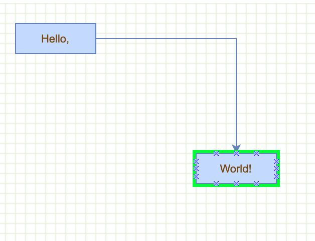
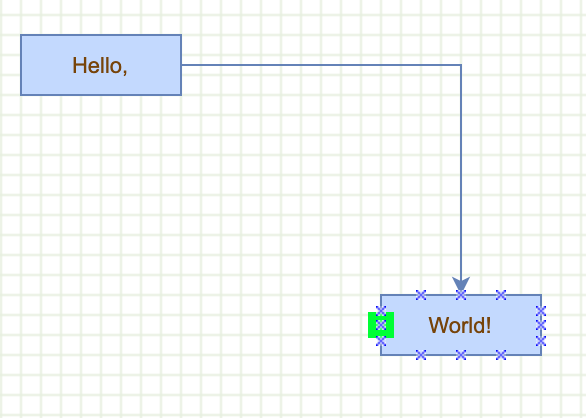
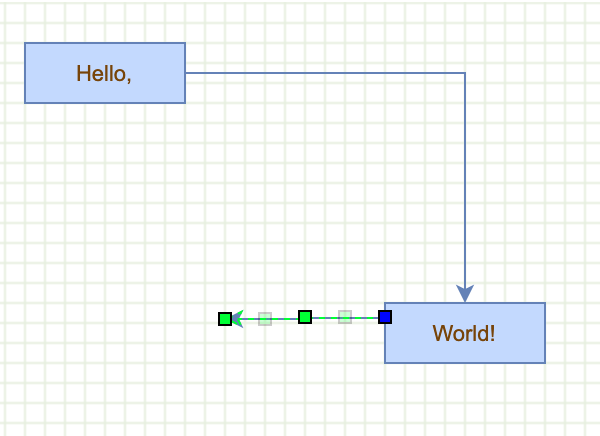

# Create Shape Anchors

Overridden to define per-shape connection points

Hovering on vertex node



Hovering on anchor



Dragging anchor




```js
mxGraph.prototype.getAllConnectionConstraints = function(terminal, source)
{
  if (terminal != null && terminal.shape != null)
  {
    if (terminal.shape.stencil != null)
    {
      if (terminal.shape.stencil.constraints != null)
      {
        return terminal.shape.stencil.constraints;
      }
    }
    else if (terminal.shape.constraints != null)
    {
      return terminal.shape.constraints;
    }
  }

  return null;
};
```

Defines the default constraints for all shapes

```js  
mxShape.prototype.constraints = [new mxConnectionConstraint(new mxPoint(0.25, 0), true),
                  new mxConnectionConstraint(new mxPoint(0.5, 0), true),
                  new mxConnectionConstraint(new mxPoint(0.75, 0), true),
                              new mxConnectionConstraint(new mxPoint(0, 0.25), true),
                              new mxConnectionConstraint(new mxPoint(0, 0.5), true),
                              new mxConnectionConstraint(new mxPoint(0, 0.75), true),
                            new mxConnectionConstraint(new mxPoint(1, 0.25), true),
                            new mxConnectionConstraint(new mxPoint(1, 0.5), true),
                            new mxConnectionConstraint(new mxPoint(1, 0.75), true),
                            new mxConnectionConstraint(new mxPoint(0.25, 1), true),
                            new mxConnectionConstraint(new mxPoint(0.5, 1), true),
                            new mxConnectionConstraint(new mxPoint(0.75, 1), true)];
```

Edges have no connection points

```js
mxPolyline.prototype.constraints = null;
```

Creates the graph inside the given container

```js
var graph = new mxGraph(container);
graph.setConnectable(true);
```

Enables connect preview for the default edge style

```js
graph.connectionHandler.createEdgeState = function(me)
{
  var edge = graph.createEdge(null, null, null, null, null);
  
  return new mxCellState(this.graph.view, edge, this.graph.getCellStyle(edge));
};
```

Specifies the default edge style

```js
graph.getStylesheet().getDefaultEdgeStyle()['edgeStyle'] = 'orthogonalEdgeStyle';
```

Enables rubberband selection

```js
new mxRubberband(graph);
```

Gets the default parent for inserting new cells. 
This is normally the first child of the root (ie. layer 0).

```js
var parent = graph.getDefaultParent();
```

Adds cells to the model in a single step

```js
graph.getModel().beginUpdate();
try
{
  var v1 = graph.insertVertex(parent, null, 'Hello,', 20, 20, 80, 30);
  var v2 = graph.insertVertex(parent, null, 'World!', 200, 150, 80, 30);
  var e1 = graph.insertEdge(parent, null, '', v1, v2);
}
```

Updates the display

```js
finally
{  
  graph.getModel().endUpdate();
}
```
