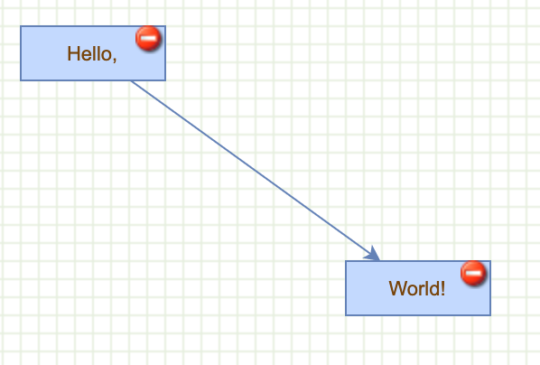

# How to add Controls to Cells

Cell controls



Creates the graph inside the given container and enables panning

```js
  var graph = new mxGraph(container);
  graph.setPanning(true);
```

Specifies the URL and size of the new control

```js
  var deleteImage = new mxImage('editors/images/overlays/forbidden.png', 16, 16);
```

Override `createControl` of `mxCellRenderer` to add an additional control to the state at creation time
Call original `createControl` method (inherit behaviour)

```js
  mxCellRendererCreateControl = mxCellRenderer.prototype.createControl;
  mxCellRenderer.prototype.createControl = function(state)
  {
    mxCellRendererCreateControl.apply(this, arguments);
```

Custom `createControl` starts here (takes `state` as input). First get graph of view state

```js
    var graph = state.view.graph;
```

If state cell is a vertex

```js
    if (graph.getModel().isVertex(state.cell)) {
```

If state does not have a delete control, 

```js
  if (state.deleteControl == null) {
```  

Create and add delete control 

```js
var b = new mxRectangle(0, 0, deleteImage.width, deleteImage.height);
state.deleteControl = new mxImageShape(b, deleteImage.src);
state.deleteControl.dialect = graph.dialect;
state.deleteControl.preserveImageAspect = false;
```

Define an `initControl` method on `mxCellRenderer` which remove the state cell if graph is enabled

```js
this.initControl(state, state.deleteControl, false, function (evt)
{
  if (graph.isEnabled())
  {
    graph.removeCells([state.cell]);
    mxEvent.consume(evt);
  }
});
```

If state already has a delete control, call destroy on the control and remove the control.

```js
    else if (state.deleteControl != null)
    {
      state.deleteControl.destroy();
      state.deleteControl = null;
    }
  };
```

Helper function to compute the bounds of the delete control.

```js
var getDeleteControlBounds = function(state) {
  if (state.deleteControl != null)
  {
    var oldScale = state.deleteControl.scale;
    var w = state.deleteControl.bounds.width / oldScale;
    var h = state.deleteControl.bounds.height / oldScale;
    var s = state.view.scale;

    return (state.view.graph.getModel().isEdge(state.cell)) ? 
      new mxRectangle(state.x + state.width / 2 - w / 2 * s,
        state.y + state.height / 2 - h / 2 * s, w * s, h * s)
      : new mxRectangle(state.x + state.width - w * s,
        state.y, w * s, h * s);
  }
  
  return null;
};
```

Override `redrawControl` method of `mxCellRenderer` to update the scale and bounds of the control
  
```js
  mxCellRendererRedrawControl = mxCellRenderer.prototype.redrawControl;
  mxCellRenderer.prototype.redrawControl = function(state)
  {
    mxCellRendererRedrawControl.apply(this, arguments);
```

If state already has a `deleteControl`

```js
    if (state.deleteControl != null)
    {
```

Get bounds of delete control

```js
  var bounds = getDeleteControlBounds(state);
  var s = state.view.scale;

  if (state.deleteControl.scale != s || !state.deleteControl.bounds.equals(bounds))
  {
    state.deleteControl.bounds = bounds;
    state.deleteControl.scale = s;
    state.deleteControl.redraw();
  }
}
```
  
Override `destroy` method of `mxCellRenderer` to remove the control if the state is destroyed

```js
mxCellRendererDestroy = mxCellRenderer.prototype.destroy;
mxCellRenderer.prototype.destroy = function(state)
{
  mxCellRendererDestroy.apply(this, arguments);

  if (state.deleteControl != null)
  {
    state.deleteControl.destroy();
    state.deleteControl = null;
  }
};
```

Uncomment the following if you want the container to fit the size of the graph

```js
// graph.setResizeContainer(true);
```

Enables rubberband selection

```js
  new mxRubberband(graph);
```

Gets the default `parent` for inserting new cells. This is normally the first child of the root (ie. layer 0).

```js
  var parent = graph.getDefaultParent();
```

Adds cells to the model in a single step

```js
  graph.getModel().beginUpdate();
  try
  {
    var v1 = graph.insertVertex(parent, null, 'Hello,', 20, 20, 80, 30);
    var v2 = graph.insertVertex(parent, null, 'World!', 200, 150, 80, 30);
    var e1 = graph.insertEdge(parent, null, '', v1, v2);
  }
```

Updates the display

```js
  finally
  {
    graph.getModel().endUpdate();
  }
```

Disable center zoom for graph

```js
  graph.centerZoom = false;
```

Add `Zoom in` and `Zoom out` buttons to document that trigger corresponding functionality

```js
  document.body.appendChild(mxUtils.button('Zoom In', function()
  {
    graph.zoomIn();
  }));
  
  document.body.appendChild(mxUtils.button('Zoom Out', function()
  {
    graph.zoomOut();
  }));
}
```