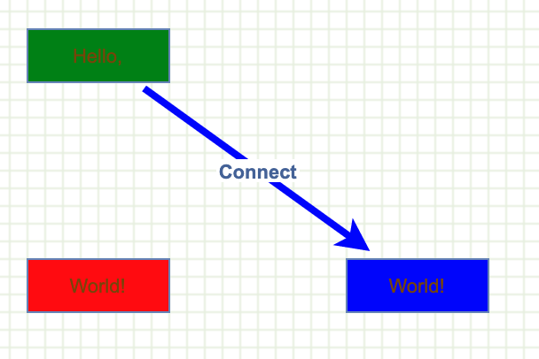

# How to dynamically change cell style

Dynamic cell style



Demonstrates changing the style of a cell dynamically by overriding `mxGraphModel.getStyle`.

Creates the graph inside the given container

```js
var graph = new mxGraph(container);
```

Disables moving of edge labels in this examples

```js
graph.edgeLabelsMovable = false;
```

Enables rubberband selection

```js
new mxRubberband(graph);
```

Needs to set a flag to check for dynamic style changes, that is, changes to styles on cells where the style was not explicitely changed using mxStyleChange

```js
graph.getView().updateStyle = true;
```

Overrides mxGraphModel.getStyle to return a specific style for edges that reflects their target terminal (in this case the strokeColor will be equal to the target's fillColor).

```js
var previous = graph.model.getStyle;

graph.model.getStyle = function(cell)
{
  if (cell != null)
  {
    var style = previous.apply(this, arguments);

    if (this.isEdge(cell))
    {
      var target = this.getTerminal(cell, false);

      if (target != null)
      {
        var targetStyle = graph.getCurrentCellStyle(target);
        var fill = mxUtils.getValue(targetStyle, mxConstants.STYLE_FILLCOLOR);

        if (fill != null)
        {
          style += ';strokeColor='+fill;
        }
      }
    }
    else if (this.isVertex(cell))
    {
      var geometry = this.getGeometry(cell);

      if (geometry != null &&
        geometry.width > 80)
      {
        style += ';fillColor=green';
      }
    }

    return style;
  }
  
  return null;
};
```

Gets the default parent for inserting new cells. This is normally the first child of the root (ie. layer 0).

```js
var parent = graph.getDefaultParent();
```

Adds cells to the model in a single step

```js
graph.getModel().beginUpdate();
try
{
  var v1 = graph.insertVertex(parent, null, 'Hello,', 20, 20, 80, 30, 'fillColor=green');
  var v2 = graph.insertVertex(parent, null, 'World!', 200, 150, 80, 30, 'fillColor=blue');
  var v3 = graph.insertVertex(parent, null, 'World!', 20, 150, 80, 30, 'fillColor=red');
  var e1 = graph.insertEdge(parent, null, 'Connect', v1, v2, 'perimeterSpacing=4;strokeWidth=4;labelBackgroundColor=white;fontStyle=1');
}
```

Updates the display

```js
finally
{
  graph.getModel().endUpdate();
}
```
