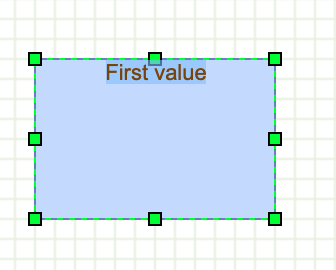

# How to enable and use in-place editing

Editing display


Edit first value



Change first value


Edit second value


Using the in-place editor trigger to specify the editing value and write the new value into
a specific field of the user object. Wrapping and DOM nodes as labels are also demonstrated here.

Creates the graph inside the given container

```js
var graph = new mxGraph(container);
```

Enable HTML labels

```js
graph.setHtmlLabels(true);
```

Adds handling of return and escape keystrokes for editing

```js
var keyHandler = new mxKeyHandler(graph);
```

Helper method that returns the fieldname to be used for a mouse event

```js
var getFieldnameForEvent = function(cell, evt)
{
  if (evt != null)
  {
```

Finds the relative coordinates inside the cell

```js
var point = mxUtils.convertPoint(graph.container,
  mxEvent.getClientX(evt), mxEvent.getClientY(evt));
var state = graph.getView().getState(cell);

if (state != null) {
  point.x -= state.x;
  point.y -= state.y;
```

Returns `second` if mouse in second half of cell

```js
  if (point.y > state.height / 2)
  {
    return 'second';
  }
}
```

Use `first` as default

```js
return 'first';
```

Returns a HTML representation of the cell where the upper half is the first value, 
lower half is second value

```js
graph.getLabel = function(cell) {
  var table = document.createElement('table');
  table.style.height = '100%';
  table.style.width = '100%';
  
  var body = document.createElement('tbody');
  var tr1 = document.createElement('tr');
  var td1 = document.createElement('td');
  td1.style.textAlign = 'center';
  td1.style.fontSize = '12px';
  td1.style.color = '#774400';
  mxUtils.write(td1, cell.value.first);
  
  var tr2 = document.createElement('tr');
  var td2 = document.createElement('td');
  td2.style.textAlign = 'center';
  td2.style.fontSize = '12px';
  td2.style.color = '#774400';
  mxUtils.write(td2, cell.value.second);
  
  tr1.appendChild(td1);
  tr2.appendChild(td2);
  body.appendChild(tr1);
  body.appendChild(tr2);
  table.appendChild(body);
  
  return table;
};
```

Returns the editing value for the given cell and event

```js
graph.getEditingValue = function(cell, evt)
{
  evt.fieldname = getFieldnameForEvent(cell, evt);

  return cell.value[evt.fieldname] || '';
};
```

Sets the new value for the given cell and trigger

```js
graph.labelChanged = function(cell, newValue, trigger)
{
  var name = (trigger != null) ? trigger.fieldname : null;
  
  if (name != null)
  {
```

Clones the user object for correct undo and puts
the new value in the correct field.

```js
    var value = mxUtils.clone(cell.value);
    value[name] = newValue;
    newValue = value;

    mxGraph.prototype.labelChanged.apply(this, arguments);
  }
};
```

Sample user objects with 2 fields

```js
var value = new Object();
value.first = 'First value';
value.second = 'Second value';
```

Gets the default parent for inserting new cells.
This is normally the first child of the root (ie. layer 0).

```js
var parent = graph.getDefaultParent();
```

Adds cells to the model in a single step

```js
graph.getModel().beginUpdate();
try
{
  var v1 = graph.insertVertex(parent, null, value, 100, 60, 120, 80, 'overflow=fill;');
}
```

Updates the display

```js
finally {
  graph.getModel().endUpdate();
}
```
