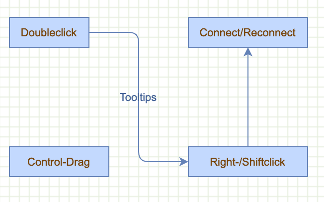
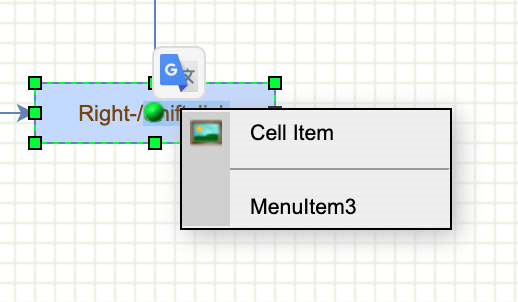

# How to create custom events

Display



Right click event to disdplay menu



This example demonstrates creating a graph container and using the mxDivResizer to update the size, interaction on the graph, including:

- marquee selection
- custom tooltips
- context menu handling
- changing the default menu opacity

It also demonstrates how to:

- use an edgestyle in the default stylesheet
- handle the doubleclick on the adjustment point
  
See also: `overlays.html` in `examples` for click event handling

Sets the image to be used for creating new connections

```js
mxConnectionHandler.prototype.connectImage = new mxImage('images/green-dot.gif', 14, 14);

var container = document.createElement('div');
container.style.position = 'absolute';
container.style.overflow = 'hidden';
container.style.left = '0px';
container.style.top = '0px';
container.style.right = '0px';
container.style.bottom = '0px';
container.style.background = 'url("editors/images/grid.gif")';
```

Disables built-in context menu

```js
mxEvent.disableContextMenu(container);
```

Workaround for Internet Explorer ignoring certain styles

```js
if (mxClient.IS_QUIRKS)
{
  document.body.style.overflow = 'hidden';
  new mxDivResizer(container);
}
```

Add container to document

```js
document.body.appendChild(container);
```

Creates the graph inside the DOM node.
Optionally you can enable panning, tooltips and connections
using graph.setPanning(), setTooltips() & setConnectable().
To enable rubberband selection and basic keyboard events,
use new mxRubberband(graph) and new mxKeyHandler(graph).

```js
var graph = new mxGraph(container);
```

Enables tooltips, new connections and panning

```js
graph.setPanning(true);
graph.setTooltips(true);
graph.setConnectable(true);
```

Automatically handle parallel edges

```js
var layout = new mxParallelEdgeLayout(graph);
var layoutMgr = new mxLayoutManager(graph);

layoutMgr.getLayout = function(cell)
{
  if (cell.getChildCount() > 0)
  {
    return layout;
  }
};
```

Enables rubberband (marquee) selection and a handler
for basic keystrokes (eg. return, escape during editing).

```js
var rubberband = new mxRubberband(graph);
var keyHandler = new mxKeyHandler(graph);
```

Changes the default style for edges "in-place" and assigns
an alternate edge style which is applied in mxGraph.flip
when the user double clicks on the adjustment control point
of the edge. The ElbowConnector edge style switches to TopToBottom
if the horizontal style is true.

```js
var style = graph.getStylesheet().getDefaultEdgeStyle();
style[mxConstants.STYLE_ROUNDED] = true;
style[mxConstants.STYLE_EDGE] = mxEdgeStyle.ElbowConnector;

graph.alternateEdgeStyle = 'elbow=vertical';
```

Installs a custom tooltip for cells

```js
graph.getTooltipForCell = function(cell)
{
  return 'Doubleclick and right- or shiftclick';
}
```

Installs a popupmenu handler using local function (see below).

```js
graph.popupMenuHandler.factoryMethod = function(menu, cell, evt)
{
  return createPopupMenu(graph, menu, cell, evt);
};
```

Gets the default parent for inserting new cells. This
is normally the first child of the root (ie. layer 0).

```js
var parent = graph.getDefaultParent();
```

Adds cells to the model in a single step

```js
graph.getModel().beginUpdate();
try
{
  var v1 = graph.insertVertex(parent, null, 'Doubleclick', 20, 20, 80, 30);
  var v2 = graph.insertVertex(parent, null, 'Right-/Shiftclick', 200, 150, 120, 30);
  var v3 = graph.insertVertex(parent, null, 'Connect/Reconnect', 200, 20, 120, 30);
  var v4 = graph.insertVertex(parent, null, 'Control-Drag', 20, 150, 100, 30);
  var e1 = graph.insertEdge(parent, null, 'Tooltips', v1, v2);
  var e2 = graph.insertEdge(parent, null, '', v2, v3);
}
```

Updates the display

```js
finally
{
  graph.getModel().endUpdate();
}
```
