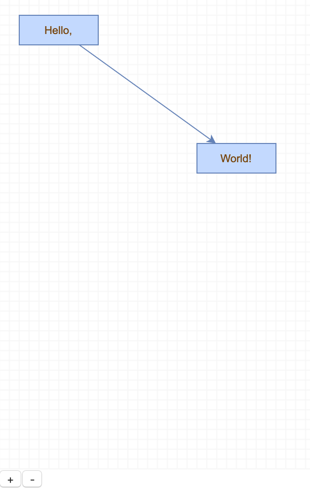

# How to draw a grid

Grid



Drawing a grid dynamically using HTML 5 canvas.

Disable context menu

```js
mxEvent.disableContextMenu(document.body);
```

Creates the graph inside the given container.
Enable panning and set grid to scale

```js
var graph = new mxGraph(container);
graph.graphHandler.scaleGrid = true;
graph.setPanning(true);
```

Enables rubberband selection

```js
new mxRubberband(graph);
```

Create grid dynamically (requires canvas)

```js
(function()
{
  try
  {
    var canvas = document.createElement('canvas');
    canvas.style.position = 'absolute';
    canvas.style.top = '0px';
    canvas.style.left = '0px';
    canvas.style.zIndex = -1;
    graph.container.appendChild(canvas);

    var ctx = canvas.getContext('2d');
```

Modify event filtering to accept canvas as container

```js
    var mxGraphViewIsContainerEvent = mxGraphView.prototype.isContainerEvent;
    mxGraphView.prototype.isContainerEvent = function(evt)
    {
      return mxGraphViewIsContainerEvent.apply(this, arguments) ||
        mxEvent.getSource(evt) == canvas;
    };

    var s = 0;
    var gs = 0;
    var tr = new mxPoint();
    var w = 0;
    var h = 0;
```

Function to repaint grid

```js
    function repaintGrid()
    {
      if (ctx != null)
      {
        var bounds = graph.getGraphBounds();
        var width = Math.max(bounds.x + bounds.width, graph.container.clientWidth);
        var height = Math.max(bounds.y + bounds.height, graph.container.clientHeight);
        var sizeChanged = width != w || height != h;

        if (graph.view.scale != s || graph.view.translate.x != tr.x || graph.view.translate.y != tr.y ||
          gs != graph.gridSize || sizeChanged)
        {
          tr = graph.view.translate.clone();
          s = graph.view.scale;
          gs = graph.gridSize;
          w = width;
          h = height;

          // Clears the background if required
          if (!sizeChanged)
          {
            ctx.clearRect(0, 0, w, h);
          }
          else
          {
            canvas.setAttribute('width', w);
            canvas.setAttribute('height', h);
          }

          var tx = tr.x * s;
          var ty = tr.y * s;

          // Sets the distance of the grid lines in pixels
          var minStepping = graph.gridSize;
          var stepping = minStepping * s;

          if (stepping < minStepping)
          {
            var count = Math.round(Math.ceil(minStepping / stepping) / 2) * 2;
            stepping = count * stepping;
          }

          var xs = Math.floor((0 - tx) / stepping) * stepping + tx;
          var xe = Math.ceil(w / stepping) * stepping;
          var ys = Math.floor((0 - ty) / stepping) * stepping + ty;
          var ye = Math.ceil(h / stepping) * stepping;

          xe += Math.ceil(stepping);
          ye += Math.ceil(stepping);

          var ixs = Math.round(xs);
          var ixe = Math.round(xe);
          var iys = Math.round(ys);
          var iye = Math.round(ye);
```

Draws the actual grid

```js
      ctx.strokeStyle = '#f6f6f6';
      ctx.beginPath();

      for (var x = xs; x <= xe; x += stepping)
      {
        x = Math.round((x - tx) / stepping) * stepping + tx;
        var ix = Math.round(x);

        ctx.moveTo(ix + 0.5, iys + 0.5);
        ctx.lineTo(ix + 0.5, iye + 0.5);
      }

      for (var y = ys; y <= ye; y += stepping)
      {
        y = Math.round((y - ty) / stepping) * stepping + ty;
        var iy = Math.round(y);

        ctx.moveTo(ixs + 0.5, iy + 0.5);
        ctx.lineTo(ixe + 0.5, iy + 0.5);
      }

      ctx.closePath();
      ctx.stroke();
    }
  }
};
```

On any exception

```js
  catch (e)
  {
    mxLog.show();
    mxLog.debug('Using background image');
    
    container.style.backgroundImage = 'url(\'editors/images/grid.gif\')';
  }
```

Validate background

```js
  var mxGraphViewValidateBackground = mxGraphView.prototype.validateBackground;
  mxGraphView.prototype.validateBackground = function()
  {
    mxGraphViewValidateBackground.apply(this, arguments);
    repaintGrid();
  };
```


Gets the default parent for inserting new cells. This is normally the first child of the root (ie. layer 0).

```js
var parent = graph.getDefaultParent();

// Adds cells to the model in a single step
graph.getModel().beginUpdate();
try
{
  var v1 = graph.insertVertex(parent, null, 'Hello,', 20, 20, 80, 30);
  var v2 = graph.insertVertex(parent, null, 'World!', 200, 150, 80, 30);
  var e1 = graph.insertEdge(parent, null, '', v1, v2);
}
```

end model update transaction

```js
finally
{
  // Updates the display
  graph.getModel().endUpdate();
}
```

Disable center zoom

```js
graph.centerZoom = false;
```

Add buttons for zooming in and out

```js
document.body.appendChild(mxUtils.button('+', function()
{
  graph.zoomIn();
}));

document.body.appendChild(mxUtils.button('-', function()
{
  graph.zoomOut();
}));
```
