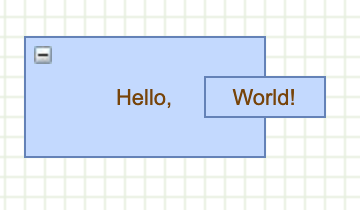

# How to use groups

Group of cells



Group collapsed


Demonstrates using cells as parts of other cells.

Overrides check for valid roots

```js
mxGraph.prototype.isValidRoot = function()
{
  return false;
};
```

Don't clear selection if multiple cells selected

```js
var graphHandlerMouseDown = mxGraphHandler.prototype.mouseDown;
mxGraphHandler.prototype.mouseDown = function(sender, me)
{
  graphHandlerMouseDown.apply(this, arguments);

  if (this.graph.isCellSelected(me.getCell()) && this.graph.getSelectionCount() > 1)
  {
    this.delayedSelection = false;
  }
};
```

Selects descendants before children selection mode

```js
var graphHandlerGetInitialCellForEvent = mxGraphHandler.prototype.getInitialCellForEvent;
mxGraphHandler.prototype.getInitialCellForEvent = function(me)
{
  var model = this.graph.getModel();
  var psel = model.getParent(this.graph.getSelectionCell());
  var cell = graphHandlerGetInitialCellForEvent.apply(this, arguments);
  var parent = model.getParent(cell);
  
  if (psel == null || (psel != cell && psel != parent))
  {
    while (!this.graph.isCellSelected(cell) && !this.graph.isCellSelected(parent) &&
        model.isVertex(parent) && !this.graph.isValidRoot(parent))
    {
      cell = parent;
      parent = this.graph.getModel().getParent(cell);
    }
  }
  
  return cell;
};
```

Selection is delayed to mouseup if child selected

```js
var graphHandlerIsDelayedSelection = mxGraphHandler.prototype.isDelayedSelection;
mxGraphHandler.prototype.isDelayedSelection = function(cell)
{
  var result = graphHandlerIsDelayedSelection.apply(this, arguments);
  var model = this.graph.getModel();
  var psel = model.getParent(this.graph.getSelectionCell());
  var parent = model.getParent(cell);
  
  if (psel == null || (psel != cell && psel != parent))
  {
    if (!this.graph.isCellSelected(cell) && model.isVertex(parent) && !this.graph.isValidRoot(parent))
    {
      result = true;
    }
  }
  
  return result;
};
```

Delayed selection of parent group

```js
mxGraphHandler.prototype.selectDelayed = function(me)
{
  var cell = me.getCell();
  
  if (cell == null)
  {
    cell = this.cell;
  }
  
  var model = this.graph.getModel();
  var parent = model.getParent(cell);
  
  while (this.graph.isCellSelected(cell) && model.isVertex(parent) && !this.graph.isValidRoot(parent))
  {
    cell = parent;
    parent = model.getParent(cell);
  }
  
  this.graph.selectCellForEvent(cell, me.getEvent());
};
```

Returns last selected ancestor

```js
mxPopupMenuHandler.prototype.getCellForPopupEvent = function(me)
{
  var cell = me.getCell();
  var model = this.graph.getModel();
  var parent = model.getParent(cell);
  
  while (model.isVertex(parent) && !this.graph.isValidRoot(parent))
  {
    if (this.graph.isCellSelected(parent))
    {
      cell = parent;
    }

    parent = model.getParent(parent);
  }
  
  return cell;
};
```

Main program

Creates the graph inside the given container

```js
var graph = new mxGraph(container);
graph.constrainChildren = false;
graph.extendParents = false;
graph.extendParentsOnAdd = false;
```

Uncomment the following if you want the container
to fit the size of the graph

```js
//graph.setResizeContainer(true);
```

Enables rubberband selection

```js
new mxRubberband(graph);
```

Gets the default parent for inserting new cells. This is normally the first child of the root (ie. layer 0).

```js
var parent = graph.getDefaultParent();
```

Adds cells to the model in a single step

```js
graph.getModel().beginUpdate();
try
{
  var v1 = graph.insertVertex(parent, null, 'Hello,', 20, 20, 120, 60);
  var v2 = graph.insertVertex(v1, null, 'World!', 90, 20, 60, 20);
}
```

Updates the display

```js
finally
{  
  graph.getModel().endUpdate();
}
```
