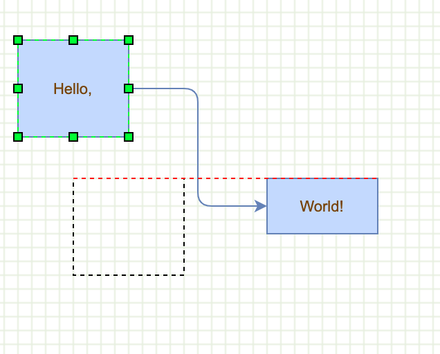

# How to use the Guides feature

Guides



Demonstrates the guides feature which aligns the current selection to the existing vertices
in the graph. This feature is in RFC state.

Creating a grid using a canvas and installing a key handler for cursor keys is also
demonstrated here, as well as snapping waypoints to terminals.

Enables guides

```js
mxGraphHandler.prototype.guidesEnabled = true;
```

Alt disables guides

```js
mxGraphHandler.prototype.useGuidesForEvent = function(me) {
  return !mxEvent.isAltDown(me.getEvent());
};
```

Defines the guides to be red (default)

```js
mxConstants.GUIDE_COLOR = '#FF0000';
```

Defines the guides to be 1 pixel (default)

```js
mxConstants.GUIDE_STROKEWIDTH = 1;
```

Enables snapping waypoints to terminals

```js
mxEdgeHandler.prototype.snapToTerminals = true;
```

Creates the graph inside the given container

```js
var graph = new mxGraph(container);
graph.setConnectable(true);
graph.gridSize = 30;
```

Changes the default style for edges "in-place" and assigns
an alternate edge style which is applied in mxGraph.flip
when the user double clicks on the adjustment control point
of the edge. The ElbowConnector edge style switches to TopToBottom
if the horizontal style is true.

```js
var style = graph.getStylesheet().getDefaultEdgeStyle();
style[mxConstants.STYLE_ROUNDED] = true;
style[mxConstants.STYLE_EDGE] = mxEdgeStyle.ElbowConnector;
graph.alternateEdgeStyle = 'elbow=vertical';
```

Enables rubberband selection

```js
new mxRubberband(graph);
```

Gets the default parent for inserting new cells. This
is normally the first child of the root (ie. layer 0).

```js
var parent = graph.getDefaultParent();
```

Adds cells to the model in a single step

```js
graph.getModel().beginUpdate();
var v1;
try {
v1 = graph.insertVertex(parent, null, 'Hello,', 20, 40, 80, 70);
var v2 = graph.insertVertex(parent, null, 'World!', 200, 140, 80, 40);
var e1 = graph.insertEdge(parent, null, '', v1, v2);
}
```

Updates the display

```js
finally {
graph.getModel().endUpdate();
}
```

Handles cursor keys

```js
var nudge = function(keyCode) {
  if (!graph.isSelectionEmpty()) {
    var dx = 0;
    var dy = 0;

    // LEFT arrow key
    if (keyCode == 37) {
      dx = -1;
    }
    // UP arrow key
    else if (keyCode == 38) {
      dy = -1;
    }
    // RIGHT arrow key
    else if (keyCode == 39) {
      dx = 1;
    }
    // DOWN arrow key
    else if (keyCode == 40) {
      dy = 1;
    }

    graph.moveCells(graph.getSelectionCells(), dx, dy);
  }
}
```

Transfer initial focus to graph container for keystroke handling

```js
graph.container.focus();
```

Handles keystroke events

```js
var keyHandler = new mxKeyHandler(graph);
```

Ignores enter keystroke. Remove this line if you want the
enter keystroke to stop editing

```js
keyHandler.enter = function() {};

// LEFT key handler - nudge left
keyHandler.bindKey(37, function() {
  nudge(37);
});

// UP key handler - nudge up
keyHandler.bindKey(38, function()
{
  nudge(38);
});

// RIGHT key handler - nudge right
keyHandler.bindKey(39, function()
{
  nudge(39);
});

// DOWN key handler - nudge down
keyHandler.bindKey(40, function()
{
  nudge(40);
});
```
