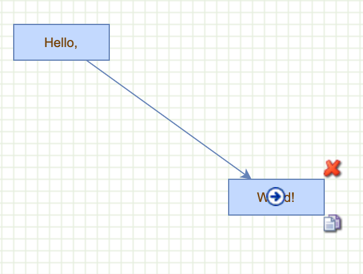

# How to display icons on vertices as mouse hovers over

Hover icons



Demonstrates showing icons on vertices as mouse hovers over them.

Defines an icon for creating new connections in the connection handler.
This will automatically disable the highlighting of the source vertex.

```js
mxConnectionHandler.prototype.connectImage = new mxImage('images/connector.gif', 16, 16);
```

Defines a new class for all icons

```js
function mxIconSet(state) {
  this.images = [];
  var graph = state.view.graph;
```

Icon1 - copy image

```js
var img = mxUtils.createImage('images/copy.png');
img.setAttribute('title', 'Duplicate');
img.style.position = 'absolute';
img.style.cursor = 'pointer';
img.style.width = '16px';
img.style.height = '16px';
img.style.left = (state.x + state.width) + 'px';
img.style.top = (state.y + state.height) + 'px';
```

Add gesture listeners for `img` image

```js
mxEvent.addGestureListeners(img,
  mxUtils.bind(this, function(evt)
  {
    var s = graph.gridSize;
    graph.setSelectionCells(graph.moveCells([state.cell], s, s, true));
    mxEvent.consume(evt);
    this.destroy();
  })
);

state.view.graph.container.appendChild(img);
this.images.push(img);
```

Delete image

```js
var img = mxUtils.createImage('images/delete2.png');
img.setAttribute('title', 'Delete');
img.style.position = 'absolute';
img.style.cursor = 'pointer';
img.style.width = '16px';
img.style.height = '16px';
img.style.left = (state.x + state.width) + 'px';
img.style.top = (state.y - 16) + 'px';
```

Add gesture listeners for `img` image

```js
mxEvent.addGestureListeners(img,
  mxUtils.bind(this, function(evt)
  {
    // Disables dragging the image
    mxEvent.consume(evt);
  })
);
```

Define on click event handler for image `img`

```js
mxEvent.addListener(img, 'click',
  mxUtils.bind(this, function(evt)
  {
    graph.removeCells([state.cell]);
    mxEvent.consume(evt);
    this.destroy();
  })
);

state.view.graph.container.appendChild(img);
this.images.push(img);
};
```

Define `destroy` method for `mxIconSet`

```js
mxIconSet.prototype.destroy = function() {
if (this.images != null)
{
  for (var i = 0; i < this.images.length; i++)
  {
    var img = this.images[i];
    img.parentNode.removeChild(img);
  }
}

this.images = null;
};
```

Create the graph inside the given container

```js
var graph = new mxGraph(container);
graph.setConnectable(true);

// Defines the tolerance before removing the icons
var iconTolerance = 20;
```

Shows icons if the mouse is over a cell

```js
  graph.addMouseListener(
  {
      currentState: null,
      currentIconSet: null,
```

`mouseDown` handler. Hides icons on mouse down

```js
mouseDown: function(sender, me) {  
  if (this.currentState != null)
  {
      this.dragLeave(me.getEvent(), this.currentState);
      this.currentState = null;
  }
},
```

`mouseMove` handler

```js
mouseMove: function(sender, me) {
  if (this.currentState != null && (me.getState() == this.currentState ||
    me.getState() == null))
  {
    var tol = iconTolerance;
    var tmp = new mxRectangle(me.getGraphX() - tol,
      me.getGraphY() - tol, 2 * tol, 2 * tol);

    if (mxUtils.intersects(tmp, this.currentState))
    {
      return;
    }
  }

var tmp = graph.view.getState(me.getCell());
```

(still `mouseMove` handler)

Ignores everything but vertices

```js
if (graph.isMouseDown || (tmp != null && !graph.getModel().isVertex(tmp.cell)))
{
  tmp = null;
}
```

(still `mouseMove` handler)

Create `dragLeave` and `dragEnter` event handlers passing `currentState`

```js
if (tmp != this.currentState)
{
  if (this.currentState != null)
  {
      this.dragLeave(me.getEvent(), this.currentState);
  }

  this.currentState = tmp;

  if (this.currentState != null)
  {
      this.dragEnter(me.getEvent(), this.currentState);
  }
}
```

`mouseup` handler

```js
      mouseUp: function(sender, me) { },
```

`dragEnter` handler

```js
dragEnter: function(evt, state) {
  if (this.currentIconSet == null)
  {
    this.currentIconSet = new mxIconSet(state);
  }
},
```

`dragLeave` handler

```js
dragLeave: function(evt, state) {
  if (this.currentIconSet != null)
  {
    this.currentIconSet.destroy();
    this.currentIconSet = null;
  }
}
```

Enables rubberband selection

```js
new mxRubberband(graph);
```

Gets the default parent for inserting new cells. 
This is normally the first child of the root (ie. layer 0).

```js  
  var parent = graph.getDefaultParent();
```

Adds cells to the model in a single step

```js
  graph.getModel().beginUpdate();
  try
  {
    var v1 = graph.insertVertex(parent, null, 'Hello,', 20, 20, 80, 30);
    var v2 = graph.insertVertex(parent, null, 'World!', 200, 150, 80, 30);
    var e1 = graph.insertEdge(parent, null, '', v1, v2);
  }
```

Updates the display

```js
  finally
  {
    graph.getModel().endUpdate();
  }
```