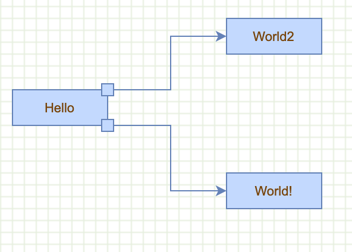
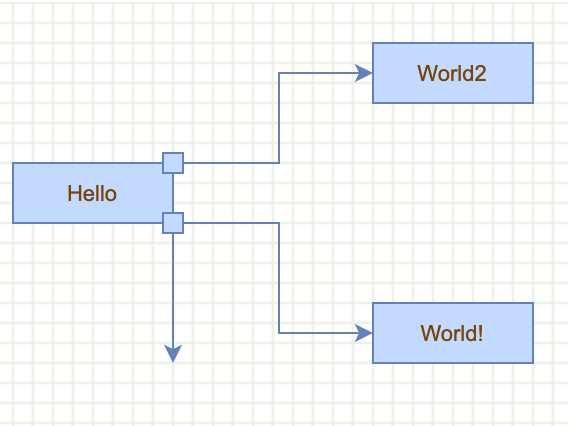

# How to use ports

Ports



Create edge from port



Demonstrates using the `isPort` hook for visually connecting to another cell.

Creates the graph inside the given container and enables:

- connections
- tooltips

```js
var graph = new mxGraph(container);
graph.setConnectable(true);
graph.setTooltips(true);
```

Sets the default edge style

```js
var style = graph.getStylesheet().getDefaultEdgeStyle();
style[mxConstants.STYLE_EDGE] = mxEdgeStyle.ElbowConnector;
```

Ports are not used as terminals for edges, they are only used to compute the graphical connection point

```js
graph.isPort = function(cell)
{
  var geo = this.getCellGeometry(cell);

  return (geo != null) ? geo.relative : false;
};
```

Implements a tooltip that shows the actual source and target of an edge

```js
graph.getTooltipForCell = function(cell)
{
  if (this.model.isEdge(cell))
  {
    return this.convertValueToString(this.model.getTerminal(cell, true)) + ' => ' +
      this.convertValueToString(this.model.getTerminal(cell, false))
  }

  return mxGraph.prototype.getTooltipForCell.apply(this, arguments);
};
```

Removes the folding icon and disables any folding

```js
graph.isCellFoldable = function(cell)
{
  return false;
};
```

Enables rubberband selection

```js
new mxRubberband(graph);
```

Gets the default parent for inserting new cells. This is normally the first child of the root (ie. layer 0).

```js
var parent = graph.getDefaultParent();
```

Adds cells to the model in a single step

```js
graph.getModel().beginUpdate();
try
{
  var v1 = graph.insertVertex(parent, null, 'Hello', 20, 80, 80, 30);
  v1.setConnectable(false);
  var v11 = graph.insertVertex(v1, null, '', 1, 1, 10, 10);
```

The offset defines the port position. Try changing the `x` value from `-5` to `-50`
The port vertex must be set to relative to be drawn relative to the "container" vertex cell.

```js
  // lower port
  v11.geometry.offset = new mxPoint(-5, -5);
  v11.geometry.relative = true;
```

The `x` and `y` position (1, 0) are somehow relative.

Try `-1, 0` and `-1, 1`, that should put the port vertex in the opposite corners

1,0: top right
1,1: bottom right
-1,0: top left
-1,1: bottom left

```js
  var v12 = graph.insertVertex(v1, null, '', 1, 0, 10, 10);
```

The offset defines the port position. Try changing the `x` value from `-5` to `-50`
The port vertex must be set to relative to be drawn relative to the "container" vertex cell.

```js  
  // upper port
  v12.geometry.offset = new mxPoint(-5, -5);
  v12.geometry.relative = true;
  var v2 = graph.insertVertex(parent, null, 'World!', 200, 150, 80, 30);
  var v3 = graph.insertVertex(parent, null, 'World2', 200, 20, 80, 30);
  var e1 = graph.insertEdge(parent, null, '', v11, v2);
  var e1 = graph.insertEdge(parent, null, '', v12, v3);
}
```

Updates the display

```js
finally
{
  
  graph.getModel().endUpdate();
}
```

Adds button to view xml of graph

```js
var button = mxUtils.button('View XML', function()
{
  var encoder = new mxCodec();
  var node = encoder.encode(graph.getModel());
  mxUtils.popup(mxUtils.getPrettyXml(node), true);
});

document.body.insertBefore(button, container.nextSibling);
```
