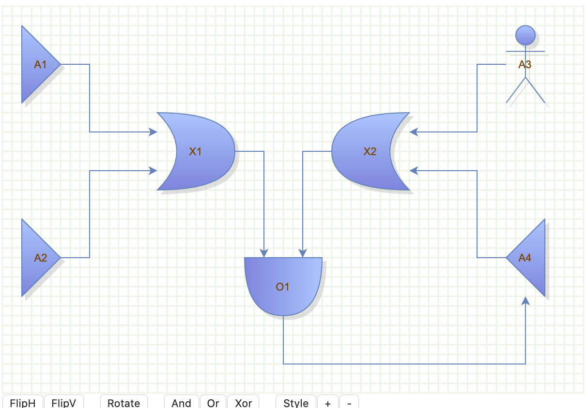

# How to use Stencils

Stencils



Demonstrates using an XML file to define new stencils to be used as shapes.
See `docs/stencils.xsd` for the XML schema file.

Sets the global shadow color

```js
mxConstants.SHADOWCOLOR = '#C0C0C0';
mxConstants.SHADOW_OPACITY = 0.5;
mxConstants.SHADOW_OFFSET_X = 4;
mxConstants.SHADOW_OFFSET_Y = 4;
mxConstants.HANDLE_FILLCOLOR = '#99ccff';
mxConstants.HANDLE_STROKECOLOR = '#0088cf';
mxConstants.VERTEX_SELECTION_COLOR = '#00a8ff';
```

Enables connections along the outline

```js
mxConnectionHandler.prototype.outlineConnect = true;
mxEdgeHandler.prototype.manageLabelHandle = true;
mxEdgeHandler.prototype.outlineConnect = true;
mxCellHighlight.prototype.keepOnTop = true;
```

Enable rotation handle

```js
mxVertexHandler.prototype.rotationEnabled = true;
```

Uses the shape for resize previews

```js
mxVertexHandler.prototype.createSelectionShape = function(bounds)
{
  var key = this.state.style[mxConstants.STYLE_SHAPE];
  var stencil = mxStencilRegistry.getStencil(key);
  var shape = null;
  
  if (stencil != null)
  {
    shape = new mxShape(stencil);
    shape.apply(this.state);
  }
  else
  {
    shape = new this.state.shape.constructor();
  }
  
  shape.outline = true;
  shape.bounds = bounds;
  shape.stroke = mxConstants.HANDLE_STROKECOLOR;
  shape.strokewidth = this.getSelectionStrokeWidth();
  shape.isDashed = this.isSelectionDashed();
  shape.isShadow = false;

  return shape;
};
```

Defines a custom stencil via the canvas API as defined here:
[mxXmlCanvas2D-js.html](http://jgraph.github.io/mxgraph/docs/js-api/files/util/mxXmlCanvas2D-js.html)

```js
function CustomShape()
{
  mxShape.call(this);
};
mxUtils.extend(CustomShape, mxShape);
CustomShape.prototype.paintBackground = function(c, x, y, w, h)
{
  c.translate(x, y);
```

Head

```js
  c.ellipse(w / 4, 0, w / 2, h / 4);
  c.fillAndStroke();

  c.begin();
  c.moveTo(w / 2, h / 4);
  c.lineTo(w / 2, 2 * h / 3);
```

Arms

```js  
  c.moveTo(w / 2, h / 3);
  c.lineTo(0, h / 3);
  c.moveTo(w / 2, h / 3);
  c.lineTo(w, h / 3);
```

Legs

```js  
  c.moveTo(w / 2, 2 * h / 3);
  c.lineTo(0, h);
  c.moveTo(w / 2, 2 * h / 3);
  c.lineTo(w, h);
  c.end();
  
  c.stroke();
};
```

Replaces existing actor shape

```js
mxCellRenderer.registerShape('customShape', CustomShape);
```

Loads the stencils into the registry

```js
var req = mxUtils.load('stencils.xml');
var root = req.getDocumentElement();
var shape = root.firstChild;

while (shape != null)
{
  if (shape.nodeType == mxConstants.NODETYPE_ELEMENT)
  {
    mxStencilRegistry.addStencil(shape.getAttribute('name'), new mxStencil(shape));
  }
  
  shape = shape.nextSibling;
}

mxEvent.disableContextMenu(container);
```

Creates the graph inside the given container

```js
var graph = new mxGraph(container);
graph.setConnectable(true);
graph.setTooltips(true);
graph.setPanning(true);

graph.getTooltipForCell = function(cell)
{
  if (cell != null)
  {
    return cell.style;
  }
  
  return null;
};
```

Changes default styles

```js
var style = graph.getStylesheet().getDefaultEdgeStyle();
style[mxConstants.STYLE_EDGE] = 'orthogonalEdgeStyle';
style = graph.getStylesheet().getDefaultVertexStyle();
style[mxConstants.STYLE_FILLCOLOR] = '#adc5ff';
style[mxConstants.STYLE_GRADIENTCOLOR] = '#7d85df';
style[mxConstants.STYLE_SHADOW] = '1';
```

Enables rubberband selection

```js
new mxRubberband(graph);
```

Gets the default parent for inserting new cells. This
is normally the first child of the root (ie. layer 0).

```js
var parent = graph.getDefaultParent();
```

Adds cells to the model in a single step

```js
graph.getModel().beginUpdate();
try
{
  var v1 = graph.insertVertex(parent, null, 'A1', 20, 20, 40, 80, 'shape=and');
  var v2 = graph.insertVertex(parent, null, 'A2', 20, 220, 40, 80, 'shape=and');
  var v3 = graph.insertVertex(parent, null, 'X1', 160, 110, 80, 80, 'shape=xor');
  var e1 = graph.insertEdge(parent, null, '', v1, v3);
  e1.geometry.points = [new mxPoint(90, 60), new mxPoint(90, 130)];
  var e2 = graph.insertEdge(parent, null, '', v2, v3);
  e2.geometry.points = [new mxPoint(90, 260), new mxPoint(90, 170)];
  
  var v4 = graph.insertVertex(parent, null, 'A3', 520, 20, 40, 80, 'shape=customShape;flipH=1');
  var v5 = graph.insertVertex(parent, null, 'A4', 520, 220, 40, 80, 'shape=and;flipH=1');
  var v6 = graph.insertVertex(parent, null, 'X2', 340, 110, 80, 80, 'shape=xor;flipH=1');
  var e3 = graph.insertEdge(parent, null, '', v4, v6);
  e3.geometry.points = [new mxPoint(490, 60), new mxPoint(130, 130)];
  var e4 = graph.insertEdge(parent, null, '', v5, v6);
  e4.geometry.points = [new mxPoint(490, 260), new mxPoint(130, 170)];
  
  var v7 = graph.insertVertex(parent, null, 'O1', 250, 260, 80, 60, 'shape=or;direction=south');
  var e5 = graph.insertEdge(parent, null, '', v6, v7);
  e5.geometry.points = [new mxPoint(310, 150)];
  var e6 = graph.insertEdge(parent, null, '', v3, v7);
  e6.geometry.points = [new mxPoint(270, 150)];
  
  var e7 = graph.insertEdge(parent, null, '', v7, v5);
  e7.geometry.points = [new mxPoint(290, 370)];
}
```

Updates the display

```js
finally
{  
  graph.getModel().endUpdate();
}

document.body.appendChild(mxUtils.button('FlipH', function()
{
  graph.toggleCellStyles(mxConstants.STYLE_FLIPH);
}));

document.body.appendChild(mxUtils.button('FlipV', function()
{
  graph.toggleCellStyles(mxConstants.STYLE_FLIPV);
}));

document.body.appendChild(document.createTextNode('\u00a0'));
document.body.appendChild(document.createTextNode('\u00a0'));
document.body.appendChild(document.createTextNode('\u00a0'));
document.body.appendChild(document.createTextNode('\u00a0'));

document.body.appendChild(mxUtils.button('Rotate', function()
{
  var cell = graph.getSelectionCell();
  
  if (cell != null)
  {
    var geo = graph.getCellGeometry(cell);

    if (geo != null)
    {
      graph.getModel().beginUpdate();
      try
      {
```

Rotates the size and position in the geometry

```js
        geo = geo.clone();
        geo.x += geo.width / 2 - geo.height / 2;
        geo.y += geo.height / 2 - geo.width / 2;
        var tmp = geo.width;
        geo.width = geo.height;
        geo.height = tmp;
        graph.getModel().setGeometry(cell, geo);
```

Reads the current direction and advances by 90 degrees

```js
        var state = graph.view.getState(cell);

        if (state != null)
        {
          var dir = state.style[mxConstants.STYLE_DIRECTION] || 'east'/*default*/;

          if (dir == 'east')
          {
            dir = 'south';
          }
          else if (dir == 'south')
          {
            dir = 'west';
          }
          else if (dir == 'west')
          {
            dir = 'north';
          }
          else if (dir == 'north')
          {
            dir = 'east';
          }
          graph.setCellStyles(mxConstants.STYLE_DIRECTION, dir, [cell]);
        }
      }
      finally
      {
        graph.getModel().endUpdate();
      }
    }
  }
}));
```

Append `no-break space` nodes to document

```js
document.body.appendChild(document.createTextNode('\u00a0'));
document.body.appendChild(document.createTextNode('\u00a0'));
document.body.appendChild(document.createTextNode('\u00a0'));
document.body.appendChild(document.createTextNode('\u00a0'));
```

Append button `And` to modify cell style `STYLE_SHAPE` with `and`

```js
document.body.appendChild(mxUtils.button('And', function()
{
  graph.setCellStyles(mxConstants.STYLE_SHAPE, 'and');
}));
```

Append button `Or` to modify cell style `STYLE_SHAPE` with `or`

```js
document.body.appendChild(mxUtils.button('Or', function()
{
  graph.setCellStyles(mxConstants.STYLE_SHAPE, 'or');
}));
```

Append button `Xor` to modify cell style `STYLE_SHAPE` with `xor`

```js
document.body.appendChild(mxUtils.button('Xor', function()
{
  graph.setCellStyles(mxConstants.STYLE_SHAPE, 'xor');
}));
```

Append `no-break space` nodes to document

```js
document.body.appendChild(document.createTextNode('\u00a0'));
document.body.appendChild(document.createTextNode('\u00a0'));
document.body.appendChild(document.createTextNode('\u00a0'));
document.body.appendChild(document.createTextNode('\u00a0'));
```

Append `Style` button to modify cell style to style input by user via prompt

```js
document.body.appendChild(mxUtils.button('Style', function()
{
  var cell = graph.getSelectionCell();
  
  if (cell != null)
  {
    var style = mxUtils.prompt('Style', graph.getModel().getStyle(cell));

    if (style != null)
    {
      graph.getModel().setStyle(cell, style);
    }
  }
}));
```

Append `+` button to zoom in on graph

```js
document.body.appendChild(mxUtils.button('+', function()
{
  graph.zoomIn();
}));
```

Append `-` button to zoom out on graph

```js
document.body.appendChild(mxUtils.button('-', function()
{
  graph.zoomOut();
}));
```
