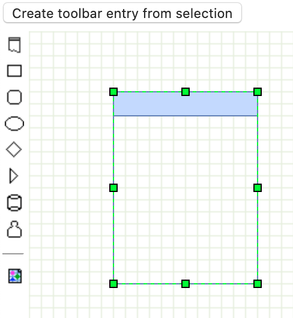

# How to Create Toolbar

Toolbar



See [examples/toolbar.html](./../../examples/toolbar.html) for the full source code

Select or create container element to contain the Toolbar, here `tbContainer`

```js
// Creates the div for the toolbar
var tbContainer = document.createElement('div');
tbContainer.style.position = 'absolute';
tbContainer.style.overflow = 'hidden';
tbContainer.style.padding = '2px';
tbContainer.style.left = '0px';
tbContainer.style.top = '26px';
tbContainer.style.width = '24px';
tbContainer.style.bottom = '0px';

// add element to document
document.body.appendChild(tbContainer);
```

Create a new toolbar using `mxToolbar` constructor

```js
// Creates new toolbar without event processing
var toolbar = new mxToolbar(tbContainer);
toolbar.enabled = false
```

```js
var addVertex = function(icon, w, h, style)
{
  var vertex = new mxCell(null, new mxGeometry(0, 0, w, h), style);
  vertex.setVertex(true);

  addToolbarItem(graph, toolbar, vertex, icon);
};
```

Add toolbar items using `addVertex` helper. The first argument is the image used in the toolbar.
Then comes the width `w` and height `h` of the toolbar item and the `style`.
The helper creates a `vertex` for each which is added to the `toolbar` using the `addToolbarItem` helper.

```js
addVertex('editors/images/swimlane.gif', 120, 160, 'shape=swimlane;startSize=20;');
addVertex('editors/images/rectangle.gif', 100, 40, '');
addVertex('editors/images/rounded.gif', 100, 40, 'shape=rounded');
addVertex('editors/images/ellipse.gif', 40, 40, 'shape=ellipse');
addVertex('editors/images/rhombus.gif', 40, 40, 'shape=rhombus');
addVertex('editors/images/triangle.gif', 40, 40, 'shape=triangle');
addVertex('editors/images/cylinder.gif', 40, 40, 'shape=cylinder');
addVertex('editors/images/actor.gif', 30, 40, 'shape=actor');
```

Add line to use for divider in toolbar (in case you want to add new section of tool items)

```js
toolbar.addLine();
```

```js
function addToolbarItem(graph, toolbar, prototype, image)
{
  // Function that is executed when the image is dropped on
  // the graph. The cell argument points to the cell under
  // the mousepointer if there is one.
  var funct = function(graph, evt, cell)
  {
    graph.stopEditing(false);

    var pt = graph.getPointForEvent(evt);
    var vertex = graph.getModel().cloneCell(prototype);
    vertex.geometry.x = pt.x;
    vertex.geometry.y = pt.y;

    graph.setSelectionCells(graph.importCells([vertex], 0, 0, cell));
  }

  // Creates the image which is used as the drag icon (preview)
  var img = toolbar.addMode(null, image, funct);
  mxUtils.makeDraggable(img, graph, funct);
}
```

Finally we create a button that can be used to create a new toolbar entry from a selection of cells in the graph. Note the use of `toolbar.addMode` which adds this custom toolbar item.

```js
var img = toolbar.addMode(null, 'editors/images/outline.gif', funct);`
```

```js
var button = mxUtils.button('Create toolbar entry from selection', function(evt)
{
  if (!graph.isSelectionEmpty())
  {
    // Creates a copy of the selection array to preserve its state
    var cells = graph.getSelectionCells();
    var bounds = graph.getView().getBounds(cells);

    // Function that is executed when the image is dropped on
    // the graph. The cell argument points to the cell under
    // the mousepointer if there is one.
    var funct = function(graph, evt, cell)
    {
      graph.stopEditing(false);

      var pt = graph.getPointForEvent(evt);
      var dx = pt.x - bounds.x;
      var dy = pt.y - bounds.y;

      graph.setSelectionCells(graph.importCells(cells, dx, dy, cell));
    }

    // Creates the image which is used as the drag icon (preview)
    var img = toolbar.addMode(null, 'editors/images/outline.gif', funct);
    mxUtils.makeDraggable(img, graph, funct);
  }
});
```

The button is then styled and added to the document

```js
button.style.position = 'absolute';
button.style.left = '2px';
button.style.top = '2px';

document.body.appendChild(button);
}
```
