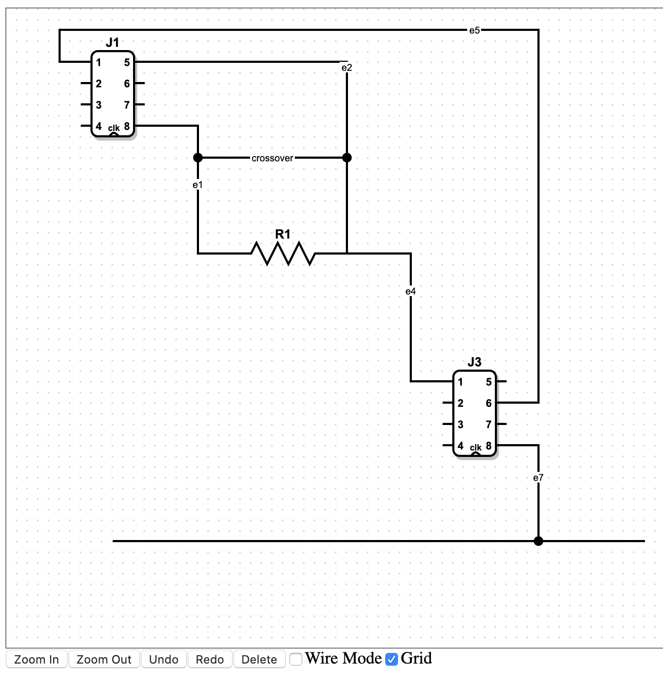

# How to create Wired between Vertices

Wires

- Edge-to-edge connections: We store the point where the mouse
was released in the terminal points of the edge geometry and
use that point to find the nearest segment on the target edge
and the connection point between the two edges in
mxGraphView.updateFixedTerminalPoint.

- The orthogonal router, which is implemented as an edge style,
computes its result based on the output of mxGraphView.
updateFixedTerminalPoint, which computes all connection points
for edge-to-edge connections and constrained ports and vertices
and stores them in state.absolutePoints. 

- Routing directions are stored in the 'portConstraint' style.
Possible values for this style horizontal and vertical. Note
that this may have other values depending on the edge style.

- For edge-to-edge connections, a 'source-/targetConstraint'
style is added in updateFixedTerminalPoint that contains the
orientation of the segment that the edge connects to. Possible
values are horizontal, vertical.

- An alternative solution for connection points via connection
constraints is demonstrated. In this setup, the edge is connected
to the parent cell directly. There are no child cells that act
as "ports". Instead, the connection information is stored as a
relative point in the connecting edge. (See also: portrefs.html
for storing references to ports.)

- [Edge-to-edge](./Wires/Edge-to-edge.md)
- [Custom resistor shape](./Wires/Custom-resistor-shape.md)
- [In-place highlighting](./Wires/In-place-highlighting.md)
- [Oval markers](./Wires/Oval-markers.md)
- [Preview and create new edges](./Wires/Preview-and-create-new-edges.md)
- [Routing](./Wires/Routing.md)
- [Wire Connector](./Wires/Wire-Connector.md)